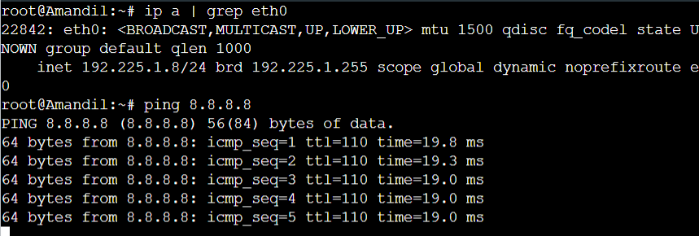
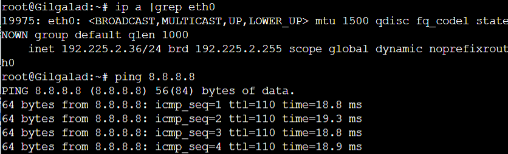
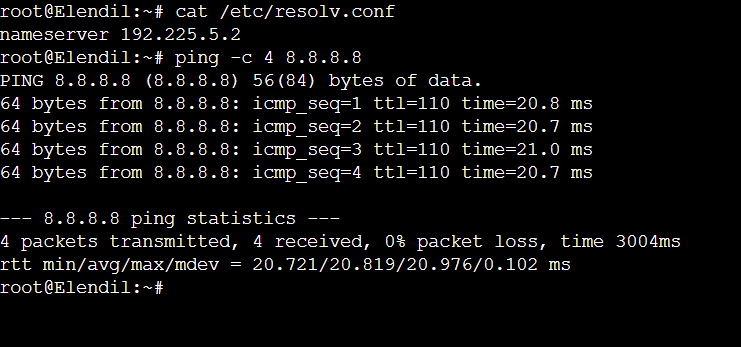
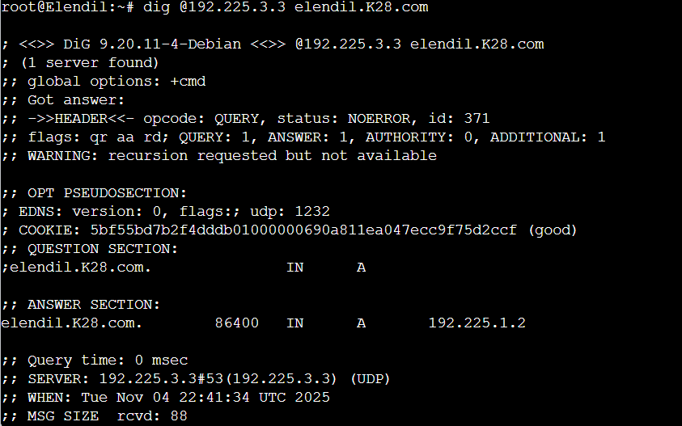
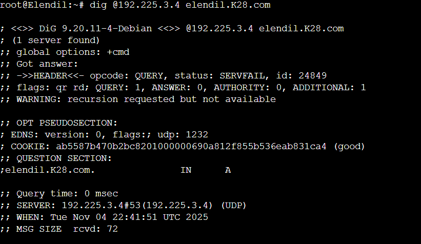
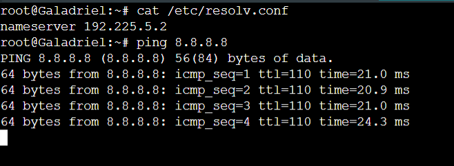
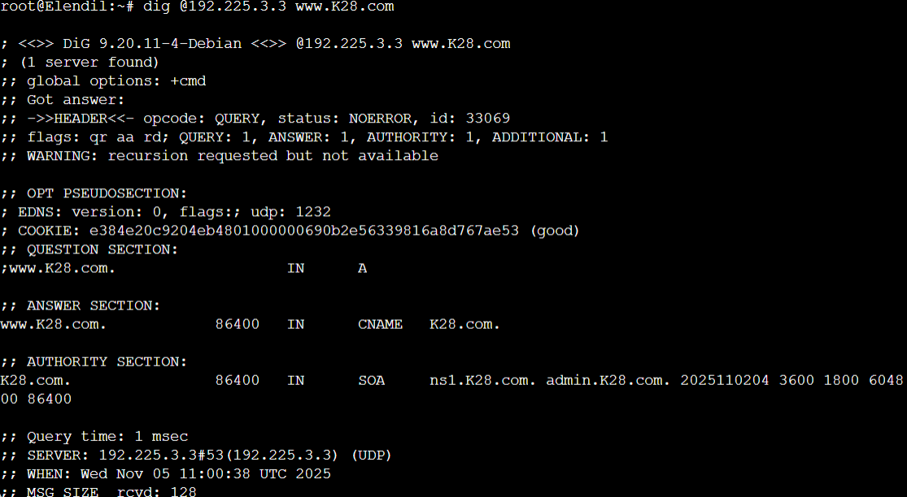

# Jarkom-Modul-3-K-28

## Member

| No  | Nama                   | NRP        |
| --- | ---------------------- | ---------- |
| 1   | Aslam Ahmad Usman      | 5027241074 |
| 2   | Zahra Hafizhah         | 5027241121 |

## Reporting

### Soal 1

Pertama kita membangun kembali jaringan topologi seperti berikut

Setelah itu tinggal memastikan bahwa setiap node dapat terhubung ke valinor/internet


### Soal 2

Langkah pertama adalah mengubah Aldarion menjadi DHCP server. Pastikan sudah menjalankan `apt install -y isc-dhcp-server`. Jika sudah, edit di `/etc/dhcp/dhcpd.conf` dengan konfigurasi berikut:
```
option domain-name "K28.com";  
option domain-name-servers 192.168.122.1;  
default-lease-time 1800;    
max-lease-time 3600;       
authoritative;

# Manusia
subnet 192.225.1.0 netmask 255.255.255.0 {
    pool {
        range 192.225.1.6 192.225.1.34;
        range 192.225.1.68 192.225.1.94;
        option routers 192.225.1.1;
        option broadcast-address 192.225.1.255;
        default-lease-time 1800;
        max-lease-time 3600;
    }
}

# Peri
subnet 192.225.2.0 netmask 255.255.255.0 {
    pool {
        range 192.225.2.35 192.225.2.67;
        range 192.225.2.96 192.225.2.121;
        option routers 192.225.2.1;
        option broadcast-address 192.225.2.255;
        default-lease-time 600;   
        max-lease-time 3600;
    }
}

subnet 192.225.3.0 netmask 255.255.255.0 {
}

subnet 192.225.4.0 netmask 255.255.255.0 {
}

subnet 192.225.5.0 netmask 255.255.255.0 {
}

host Khamul {
    hardware ethernet 02:42:c5:0d:e0:00; 
    fixed-address 192.225.3.95;
}

```

Pastikan range setiap keluarga sudah sesuai dan juga pastikan mac address Khamul sudah sesuai. Lalu isi juga `INTERFACESv4` di `/etc/default/isc-dhcp-server` dengan `eth0`. Jika sudah maka jalankan `service isc-dhcp-server restart`, server sudah dipastikan berjalan jika muncul output berikut.

Pada Durin kita akan membuat DHCP relay, pastikan sudah menjalankan `apt install -y isc-dhcp-relay`, lalu edit `/etc/default/isc-dhcp-relay` pada bagian SERVERS dengan IP Aldarion dan INTERFACES dengan `eth1 eth2 eth3 eth4 eth5`. Setelah itu jalankan service isc-dhcp-relay restart, DHCP relay sudah berjalankan jika ada output berikut

Lalu selanjutnya adalah mengubah konfigurasi setiap klien dinamis (Amandil dan Gilgalad)

```
auto eth0
iface eth0 inet dhcp
    up echo "nameserver 192.168.122.1" > /etc/resolv.conf
```


Lalu jalankan `ip addr flush dev eth0` dan `ifdown eth0; ifup eth0`. Selanjutnya tes apakah ip dari klien dinamis benar-benar sudah sesuai dengan `ip a | grep eth0` dan cek berdasarkan masing-masing keluarga apakah sudah sesuai dengan masing-masing rentangnya, dan jalankan juga `ping 8.8.8.8` untuk melihat apakah internet benar berjalan pada klien dinamis.





Terakhir jalankan `ifup eth0` dan `ip a` pada Khamul yang kita set MAC di Aldarion dan pastikan ip yang muncul harus `192.225.3.95`


### Soal 3

Tujuan utama soal ini adalah menjadikan Ministir sebagai Forward Proxy. 

Pertama pastikan sudah menjalankan `apt install -y unbound` pada Ministir. Lalu edit `/etc/unbound/unbound.conf` dengan konfigurasi berikut:

```c
server:
    interface: 0.0.0.0
    port: 53
    do-ip4: yes
    do-udp: yes
    do-tcp: yes
    access-control: 192.225.0.0/16 allow
    access-control: 0.0.0.0/0 refuse
    hide-identity: yes
    hide-version: yes
    cache-min-ttl: 300
    cache-max-ttl: 86400

forward-zone:
    name: "."
    forward-addr: 192.168.122.1
```


Setelah itu tambahkan ip ministir pada konfigurasi `/etc/network/interfaces` di setiap node

```c
dns-nameservers 192.225.5.2
echo "nameserver 192.225.5.2" > /etc/resolv.conf
```

Setelah restart node lakukan verifikasi seperti berikut.




### Soal 4


Untuk soal ini kita membuat Master-Slave DNS. Pertama untuk konfigurasi master di Erendis.

/etc/bind/named.conf.local

```c
zone "K28.com" {
    type master;
    file "/etc/bind/db.K28.com";
    allow-transfer { 192.225.3.4; };  
};

zone "1.225.192.in-addr.arpa" { type master; file "/etc/bind/db.192.225.1"; allow-transfer { 192.225.3.4; }; };
zone "2.225.192.in-addr.arpa" { type master; file "/etc/bind/db.192.225.2"; allow-transfer { 192.225.3.4; }; };
zone "3.225.192.in-addr.arpa" { type master; file "/etc/bind/db.192.225.3"; allow-transfer { 192.225.3.4; }; };
zone "4.225.192.in-addr.arpa" { type master; file "/etc/bind/db.192.225.4"; allow-transfer { 192.225.3.4; }; };
zone "5.225.192.in-addr.arpa" { type master; file "/etc/bind/db.192.225.5"; allow-transfer { 192.225.3.4; }; };
```


/etc/bind/db.K28.com

```
\$TTL 86400
@       IN      SOA     ns1.K28.com. admin.K28.com. (
                        2025110201 ; Serial
                        3600       ; Refresh
                        1800       ; Retry
                        604800     ; Expire
                        86400 )    ; Minimum TTL
        IN      NS      ns1.K28.com.
        IN      NS      ns2.K28.com.

; NS Records
ns1     IN      A       192.225.3.3     ; Erendis
ns2     IN      A       192.225.3.4     ; Amdir

; A Records (Lokasi Penting)
palantir    IN      A       192.225.4.3
elros       IN      A       192.225.4.7
pharazon    IN      A       192.225.4.4
elendil     IN      A       192.225.1.2
isildur     IN      A       192.225.1.3
anarion     IN      A       192.225.1.4
galadriel   IN      A       192.225.2.5
celeborn    IN      A       192.225.2.6
oropher     IN      A       192.225.2.7
```


/etc/bind/db.192.225.x

```c
@       IN      SOA     ns1.K28.com. admin.K28.com. (
                        2025110201
                        3600 1800 604800 86400 )
        IN      NS      ns1.K28.com.
        IN      NS      ns2.K28.com.

1       IN      PTR     durin.K28.com.
x       IN      PTR     x.K28.com.
```


Konfigurasi pada Amdir, `/etc/bind/named.conf.local` 

```
zone "K28.com" {
    type slave;
    file "/var/cache/bind/db.K28.com";
    masters { 192.225.3.3; };  }; 

zone "1.225.192.in-addr.arpa" { type slave; file "/var/cache/bind/db.192.225.1"; masters { 192.225.3.3; }; };
zone "2.225.192.in-addr.arpa" { type slave; file "/var/cache/bind/db.192.225.2"; masters { 192.225.3.3; }; };
zone "3.225.192.in-addr.arpa" { type slave; file "/var/cache/bind/db.192.225.3"; masters { 192.225.3.3; }; };
zone "4.225.192.in-addr.arpa" { type slave; file "/var/cache/bind/db.192.225.4"; masters { 192.225.3.3; }; };
zone "5.225.192.in-addr.arpa" { type slave; file "/var/cache/bind/db.192.225.5"; masters { 192.225.3.3; }; };
```

Setelah itu jalankan `named -g` pada kedua node dan lakukan tes dengan `@192.225.3.3 K28.com` dan `@192.225.3.4 K28.com` di node lain.








### Soal 5

Pertama update di `/etc/bind/db.K28.com` Erendis

```
; CNAME
www     IN      CNAME   K28.com.

; TXT Records (Pesan Rahasia)
elros       IN      TXT     "Cincin Sauron"
pharazon    IN      TXT     "Aliansi Terakhir"
```

Lalu verifikasi di node lain dengan `dig @192.225.3.3 www.K28.com `, `dig elros.K28.com TXT`,
dan `dig pharazon.K28.com TXT`.


